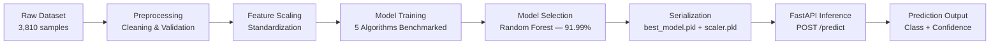

<div align="center">

# 🌾 RiceAI — Rice Variety Classification using Machine Learning

**An end-to-end Machine Learning web application that classifies rice grain varieties from morphological measurements, served through a FastAPI backend with a responsive, modern dashboard.**

[](https://www.python.org/)
[](https://fastapi.tiangolo.com/)
[](https://scikit-learn.org/)
[](LICENSE)
[]()
[](https://riceai-demo.onrender.com)

[Live Demo](#) · [Report Bug](#) · [Request Feature](#)

</div>

---

## 📌 Table of Contents

- [Overview](#-overview)
- [Tech Stack](#-tech-stack)
- [Model Details](#-model-details)
- [Features](#-features)
- [Project Structure](#-project-structure)
- [Installation](#-installation)
- [Usage](#-usage)
- [Screenshots](#-screenshots)
- [API Documentation](#-api-documentation)
- [Model Workflow](#-model-workflow)
- [Future Improvements](#-future-improvements)
- [Author](#-author)
- [License](#-license)

---

## 🔍 Overview

**RiceAI** is a Machine Learning–powered web application that classifies rice grains into one of two varieties — **Cammeo** or **Osmancik** — based on **seven morphological features** extracted from grain imagery. The trained model is served via a **FastAPI** backend and presented through a clean, responsive dashboard, enabling users to input grain measurements and receive instant, confidence-scored predictions.

This project demonstrates a complete, end-to-end Machine Learning workflow, combining:

- 🧠 **Machine Learning** — Systematic benchmarking and selection of a production-grade classification model
- ⚙️ **FastAPI Backend** — A lightweight, high-performance API layer serving predictions in real time
- 🎨 **Responsive Frontend** — A polished, device-agnostic interface built with HTML5, CSS3, and JavaScript
- 🚀 **Model Deployment** — A production-ready structure designed for seamless cloud deployment
- 🔁 **End-to-end ML Workflow** — Covering data preprocessing, scaling, training, evaluation, and inference

Built as a portfolio-grade project, RiceAI showcases applied Machine Learning engineering alongside full-stack development skills, from raw data to a live, interactive product.

> **💡 Highlight:** The production model (Random Forest) achieves **91.99% accuracy** on the held-out test set and a **92.78% cross-validation accuracy**, selected after benchmarking five different classification algorithms.

**Core capabilities:**

- 🧠 Binary classification of rice grains (Cammeo vs. Osmancik)
- ⚡ FastAPI backend exposing a real-time prediction endpoint
- 🎨 Responsive HTML/CSS/JavaScript frontend
- 📊 Instant predictions with confidence scoring
- 🖥️ Professional, dashboard-style user interface

---

## 🛠 Tech Stack

<table>
<tr>
<td valign="top" width="33%">

**Frontend**
- HTML5
- CSS3
- JavaScript

</td>
<td valign="top" width="33%">

**Backend**
- FastAPI
- Jinja2 Templates
- Uvicorn

</td>
<td valign="top" width="33%">

**Machine Learning**
- Python
- Scikit-learn
- Pandas
- NumPy
- Joblib

</td>
</tr>
</table>

**Deployment**

- [Render](https://render.com/)
- [Railway](https://railway.app/)

The project's lightweight FastAPI architecture and minimal dependency footprint make it straightforward to deploy on either platform with little to no configuration changes.

---

## 🤖 Model Details

| Attribute | Value |
|---|---|
| **Algorithm** | Random Forest Classifier |
| **Dataset Size** | 3,810 samples |
| **Number of Features** | 7 |
| **Target Classes** | Cammeo, Osmancik |
| **Test Accuracy** | **91.99%** |
| **Cross-Validation Accuracy** | 92.78% |

**Input Features:**

| # | Feature | Description |
|---|---|---|
| 1 | `Area` | Number of pixels within the grain boundary |
| 2 | `Perimeter` | Length of the grain's border |
| 3 | `Major_Axis_Length` | Length of the longest axis through the grain |
| 4 | `Minor_Axis_Length` | Length of the shortest axis through the grain |
| 5 | `Eccentricity` | Measure of how elongated the grain's ellipse fit is |
| 6 | `Convex_Area` | Pixel count of the smallest convex shape enclosing the grain |
| 7 | `Extent` | Ratio of grain area to bounding box area |

<details>
<summary><strong>📈 Full Model Benchmark Comparison</strong></summary>
<br>

Five classification algorithms were trained and evaluated; **Random Forest** was selected as the production model based on the highest test accuracy.

| Model | Accuracy | Precision | Recall | F1-Score | CV Mean Accuracy | CV Std Dev |
|---|---|---|---|---|---|---|
| Logistic Regression | 91.86% | 91.89% | 91.86% | 91.83% | 93.44% | ±0.68% |
| Decision Tree | 91.21% | 91.20% | 91.21% | 91.19% | 92.39% | ±0.84% |
| K-Nearest Neighbors (KNN) | 91.60% | 91.61% | 91.60% | 91.58% | 92.78% | ±0.68% |
| Support Vector Machine (SVM) | 91.86% | 91.88% | 91.86% | 91.84% | 93.41% | ±0.81% |
| **Random Forest ✅** | **91.99%** | **92.03%** | **91.99%** | **91.96%** | **92.78%** | ±0.77% |

</details>

---

## ✨ Features

- **🖼️ Professional Landing Page** — Clean, modern home page introducing the project, dataset, and model performance at a glance.
- **📊 Interactive Prediction Dashboard** — A dedicated interface for entering grain measurements and receiving instant classification results.
- **⚡ Real-time Prediction** — Predictions are computed and returned without page reloads, powered by asynchronous requests to the FastAPI backend.
- **🎯 Confidence Score** — Every prediction is accompanied by a confidence score indicating the model's certainty.
- **📱 Responsive Design** — Fully responsive layout that adapts seamlessly across desktop, tablet, and mobile devices.
- **🧠 Machine Learning Integration** — A trained Random Forest model and its accompanying scaler are loaded via Joblib and served directly through the backend.
- **🔗 REST API** — Clean, well-documented REST endpoints for programmatic access to predictions.
- **🎬 Prediction Animations** — Subtle UI animations enhance the feel of the prediction result reveal.
- **👤 Developer Profile Section** — A dedicated section showcasing the author's background and links.
- **🌑 Dark Modern UI** — A sleek dark-themed interface designed for a professional, polished look.

---

## 📂 Project Structure

```
RiceAI/
├── app.py                     # FastAPI application entry point
├── predict.py                 # Model loading and prediction logic
├── requirements.txt           # Python dependencies
├── results/
│   └── results.json           # Model training/benchmark results
├── models/
│   ├── best_model.pkl         # Serialized Random Forest classifier
│   └── scaler.pkl             # Serialized feature scaler
├── static/
│   ├── css/                   # Stylesheets for the frontend
│   ├── js/                    # Frontend interaction logic
│   └── images/                # Static image assets
├── templates/
│   ├── base.html               # Shared base layout template
│   ├── index.html              # Home page template
│   └── predictor.html          # Prediction dashboard template
├── screenshots/
│   ├── home.png
│   ├── predictor.png
│   ├── prediction-result.png
│   ├── developer.png
│   ├── model-performance.png
│   ├── confusion-matrix.png
│   └── feature-importance.png
├── notebooks/
│   └── model_training.ipynb   # Data preprocessing & model training notebook
├── LICENSE
└── README.md
```

---

## ⚙️ Installation

Follow these steps to set up the project locally.

**1. Clone the Repository**

```bash
git clone https://github.com/<your-username>/RiceAI.git
cd RiceAI
```

**2. Create a Virtual Environment**

```bash
python -m venv venv
```

**3. Activate the Virtual Environment**

```bash
# Windows
venv\Scripts\activate

# macOS / Linux
source venv/bin/activate
```

**4. Install Requirements**

```bash
pip install -r requirements.txt
```

**5. Run the FastAPI Server**

```bash
uvicorn app:app --reload
```

**6. Open the Application**

Navigate to:

```
http://127.0.0.1:8000
```

> **📝 Note:** Interactive API documentation (Swagger UI) is automatically available at `http://127.0.0.1:8000/docs`.

---

## 🚀 Usage

1. **Open the Home Page** — View the project overview, dataset summary, and model performance metrics.
2. **Navigate to the Prediction Dashboard** — Click through to the `/predict` page.
3. **Enter Grain Features** — Input the seven morphological measurements (`Area`, `Perimeter`, `Major_Axis_Length`, `Minor_Axis_Length`, `Eccentricity`, `Convex_Area`, `Extent`).
4. **Use a Sample Grain** *(optional)* — Load a pre-filled sample record to quickly test the classifier.
5. **Predict the Rice Variety** — Submit the form to trigger a real-time prediction request to the backend.
6. **View the Result and Confidence Score** — The predicted variety (Cammeo or Osmancik) is displayed along with the model's confidence percentage.

---

## 📸 Screenshots

> **Note:** Replace the image paths below with actual screenshots stored in the `screenshots/` directory.

### Home Page


### Prediction Dashboard


### Prediction Result


### Developer Section


### Model Performance


### Confusion Matrix


### Feature Importance


---

## 🔌 API Documentation

### `GET /`

Renders the home page, including dataset summary and model performance metrics.

**Response:** `text/html` (rendered Jinja2 template)

---

### `GET /predict`

Renders the interactive prediction dashboard page.

**Response:** `text/html` (rendered Jinja2 template)

---

### `POST /predict`

Accepts rice grain morphological features and returns the predicted variety with a confidence score.

**Request Body:**

```json
{
  "Area": 15231.0,
  "Perimeter": 495.34,
  "Major_Axis_Length": 189.42,
  "Minor_Axis_Length": 103.76,
  "Eccentricity": 0.8365,
  "Convex_Area": 15421.0,
  "Extent": 0.7124
}
```

**Example cURL Request:**

```bash
curl -X POST "http://127.0.0.1:8000/predict" \
  -H "Content-Type: application/json" \
  -d '{
    "Area": 15231.0,
    "Perimeter": 495.34,
    "Major_Axis_Length": 189.42,
    "Minor_Axis_Length": 103.76,
    "Eccentricity": 0.8365,
    "Convex_Area": 15421.0,
    "Extent": 0.7124
  }'
```

**Example Response:**

```json
{
  "prediction": "Cammeo",
  "confidence": 100.0
}
```

---

## 🔄 Model Workflow



1. **Dataset** — 3,810 rice grain samples with 7 morphological features, labeled as either Cammeo or Osmancik.
2. **Preprocessing** — Data cleaning, null/duplicate checks, and validation of feature ranges.
3. **Scaling** — Numerical features are standardized using a fitted scaler to ensure consistent model input distributions.
4. **Training** — Five classification algorithms (Logistic Regression, Decision Tree, KNN, SVM, Random Forest) are trained and evaluated using cross-validation.
5. **Prediction** — The best-performing model (Random Forest) and its scaler are serialized via Joblib as `best_model.pkl` and `scaler.pkl`, and loaded by the FastAPI backend at runtime.
6. **Output** — The API returns the predicted rice variety along with a confidence score.

---

## 🔮 Future Improvements

- [ ] **Image Classification using CNN** — Classify rice variety directly from grain images using convolutional neural networks.
- [ ] **Docker** — Containerize the application for consistent, portable deployments.
- [ ] **Cloud Deployment** — Full production deployment on Render, Railway, AWS, or GCP with CI/CD pipelines.
- [ ] **Model Monitoring** — Track live prediction metrics and detect model/data drift over time.
- [ ] **Prediction History** — Store and display past predictions for logged-in users.
- [ ] **Authentication** — Add user accounts and secure access to prediction history and saved results.
- [ ] **Support for Additional Rice Varieties** — Extend the model beyond Cammeo and Osmancik to support multi-class classification.

---

## 👨‍💻 Author

<div align="center">

### Vansh Dadeech

**AI & Machine Learning Enthusiast**
B.Tech, Computer Science (Artificial Intelligence & Machine Learning)
Model Institute of Engineering & Technology (MIET), Jammu

[](https://github.com/<your-username>)
[](https://linkedin.com/in/<your-profile>)
[](https://instagram.com/<your-handle>)

</div>

> **📬 Note:** Replace the placeholder links above with your actual GitHub, LinkedIn, and Instagram profile URLs.

---

## 📄 License

This project is licensed under the **MIT License**.

```
MIT License

Copyright (c) 2026 Vansh Dadeech

Permission is hereby granted, free of charge, to any person obtaining a copy
of this software and associated documentation files (the "Software"), to deal
in the Software without restriction, including without limitation the rights
to use, copy, modify, merge, publish, distribute, sublicense, and/or sell
copies of the Software, and to permit persons to whom the Software is
furnished to do so, subject to the following conditions:

The above copyright notice and this permission notice shall be included in all
copies or substantial portions of the Software.

THE SOFTWARE IS PROVIDED "AS IS", WITHOUT WARRANTY OF ANY KIND, EXPRESS OR
IMPLIED, INCLUDING BUT NOT LIMITED TO THE WARRANTIES OF MERCHANTABILITY,
FITNESS FOR A PARTICULAR PURPOSE AND NONINFRINGEMENT. IN NO EVENT SHALL THE
AUTHORS OR COPYRIGHT HOLDERS BE LIABLE FOR ANY CLAIM, DAMAGES OR OTHER
LIABILITY, WHETHER IN AN ACTION OF CONTRACT, TORT OR OTHERWISE, ARISING FROM,
OUT OF OR IN CONNECTION WITH THE SOFTWARE OR THE USE OR OTHER DEALINGS IN THE
SOFTWARE.
```

See the [LICENSE](LICENSE) file for full details.

---

<div align="center">

**⭐ If you found this project helpful, consider giving it a star on GitHub!**

Designed and Developed by Vansh Dadeech

</div>
