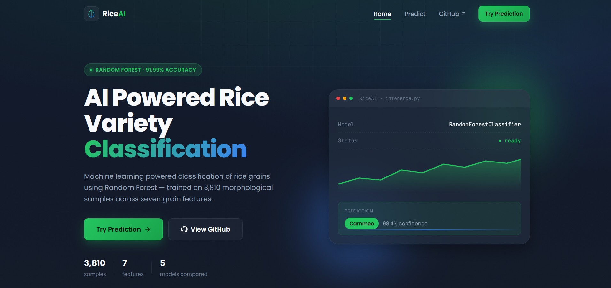
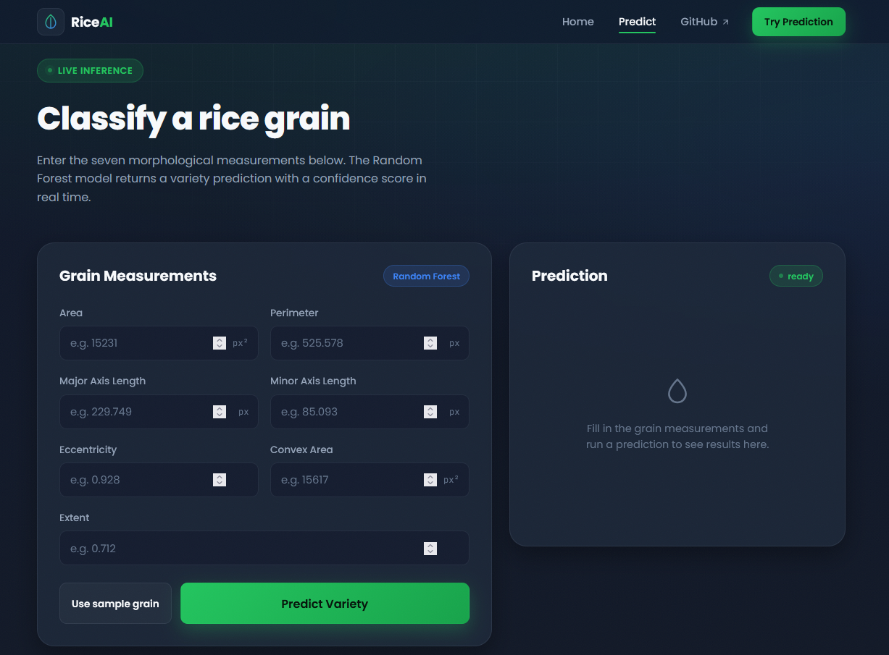
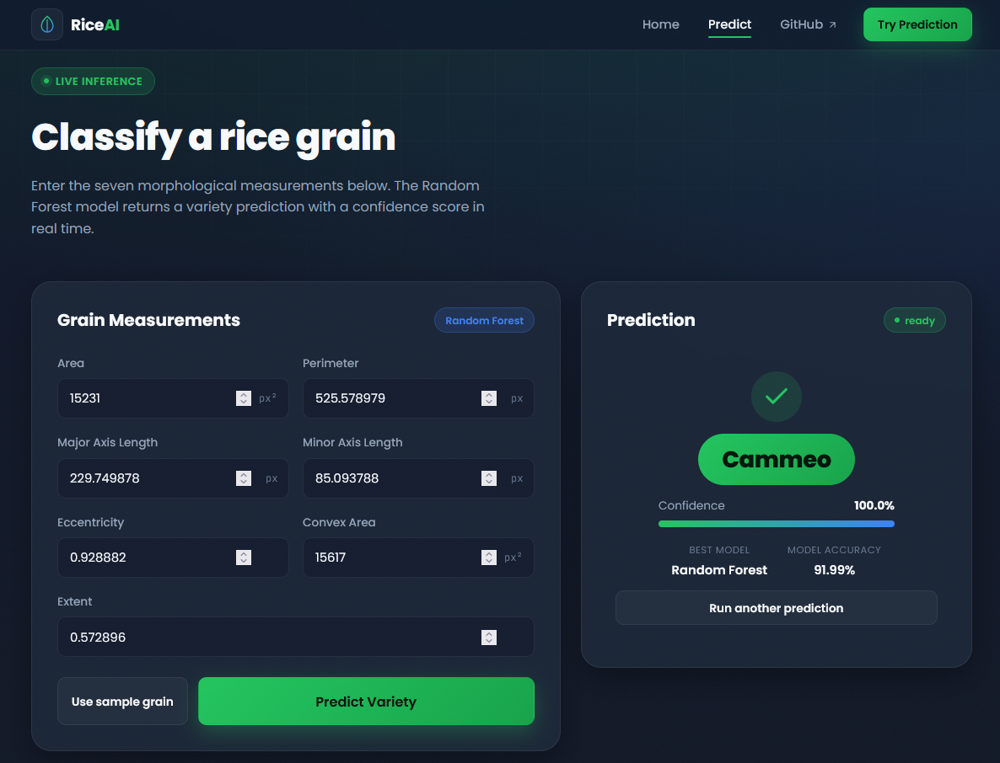
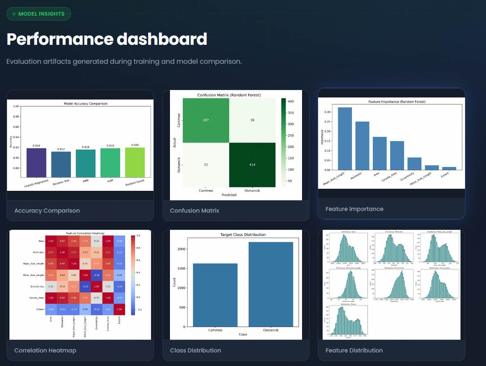
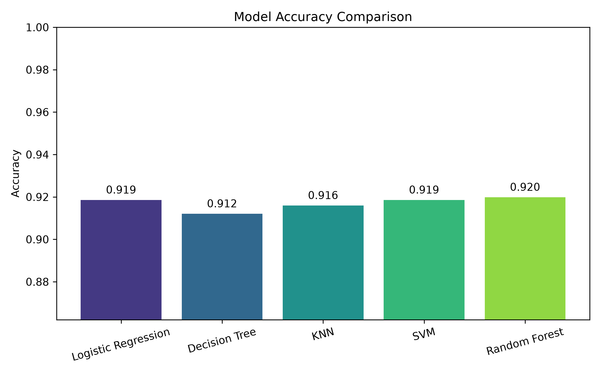
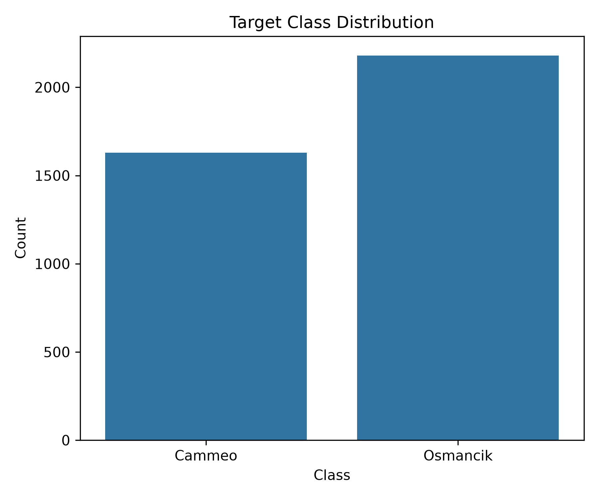
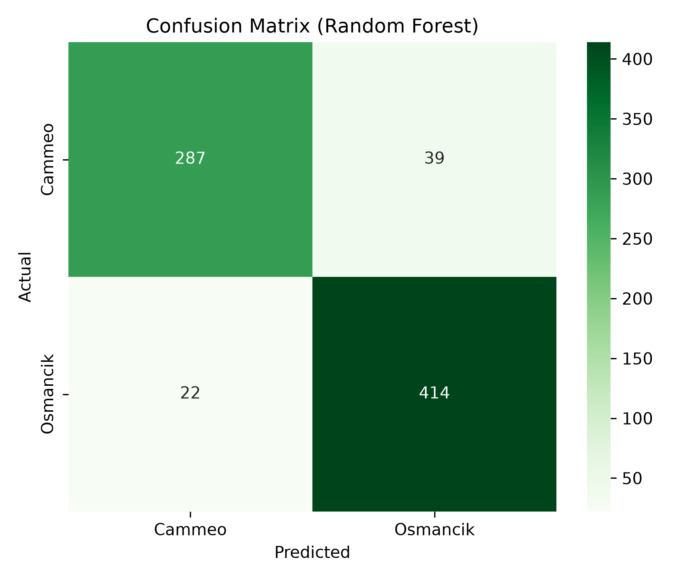
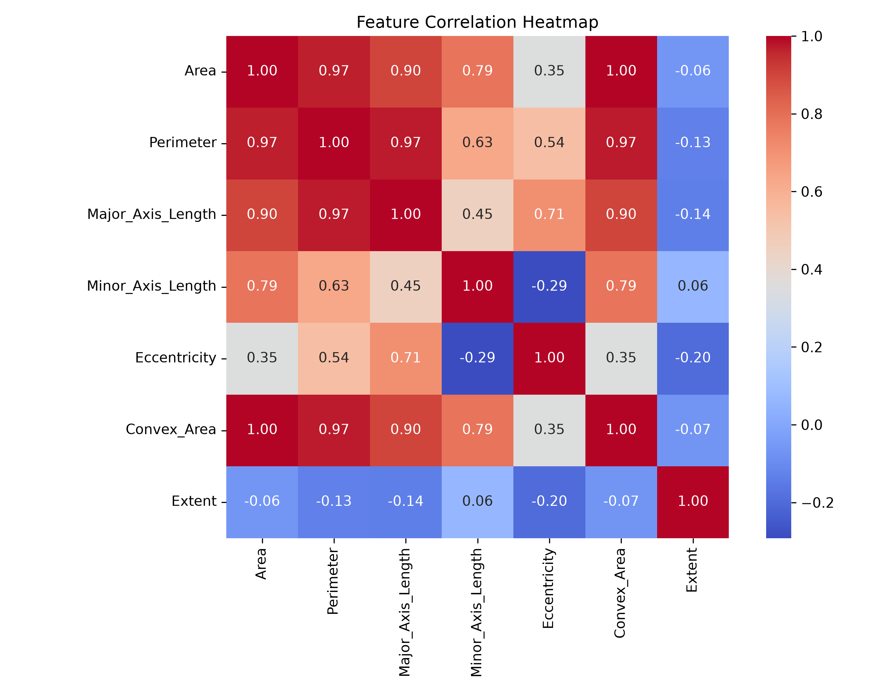
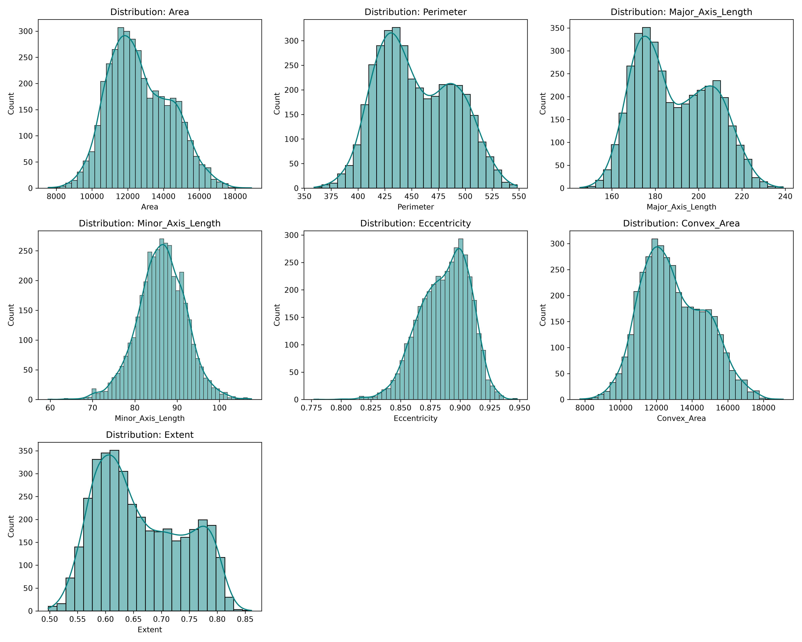
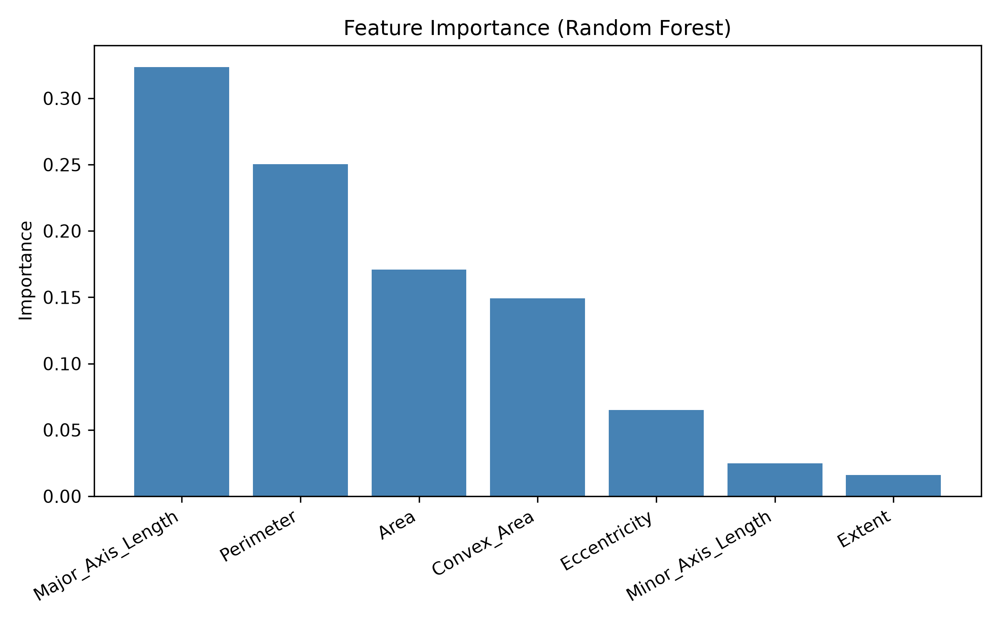

<div align="center">

# 🌾 RiceAI

### AI Powered Rice Variety Classification

*Predicting rice grain varieties with Machine Learning — in real time.*

[](https://riceai.onrender.com/)
[](https://www.python.org/)
[](https://fastapi.tiangolo.com/)
[](https://scikit-learn.org/)
[](https://render.com/)
[](#)

<br>

[](#)
[](#)
[](#)

</div>

---

## 🚀 Live Demo

<div align="center">

### 🌐 The application is **fully deployed and live** — no setup required!

## 👉 **[https://riceai.onrender.com/](https://riceai.onrender.com/)** 👈

Simply visit the link above, enter grain measurements, and get an instant AI-powered prediction with confidence scores.

> ⚡ **Note:** The app is hosted on Render's free tier, so the first load may take a few seconds to spin up. Thank you for your patience!

</div>

---

## 📖 Overview

**RiceAI** is an end-to-end Machine Learning web application that predicts whether a rice grain belongs to the **Cammeo** or **Osmancik** variety, using **seven physical characteristics** extracted from grain imagery.

The project goes beyond a simple model — it **compares multiple machine learning algorithms**, evaluates them on real performance metrics, and **automatically selects the best-performing model** for deployment.

The final model is served through a **FastAPI** backend, wrapped in a clean, responsive web interface that delivers **real-time predictions with confidence scores**.

🔗 **Try it now → [riceai.onrender.com](https://riceai.onrender.com/)**

---

## ✨ Features

| Feature | Description |
|---|---|
| 🧠 **Multi-Model Comparison** | Trains and evaluates 5 different ML algorithms |
| 🏆 **Automatic Best Model Selection** | Picks the highest-performing model automatically |
| ⚡ **Real-Time Predictions** | Instant classification via a live web app |
| 📊 **Confidence Scores** | Every prediction includes a probability score |
| 🎨 **Clean Web Interface** | Built with responsive HTML5, CSS3 & JavaScript |
| 📈 **Rich Visual Analytics** | Correlation heatmaps, feature importance & more |
| ☁️ **Fully Deployed** | Live on Render — accessible from anywhere |

---

## 📊 Dataset

<div align="center">

| Attribute | Value |
|---|---|
| 📦 Total Samples | **3,810** |
| 🔢 Features | **7** |
| 🏷️ Classes | **Cammeo**, **Osmancik** |
| 📁 Format | CSV |

</div>

The dataset consists of morphological measurements extracted from images of rice grains, capturing geometric properties such as area, perimeter, axis lengths, eccentricity, and more — enough signal for a model to reliably distinguish between the two varieties.

---

## 🔬 Machine Learning Pipeline

```
🌾 Rice Dataset
      ↓
🧹 Data Cleaning
      ↓
📏 Feature Scaling
      ↓
✂️ Train-Test Split
      ↓
🤖 Model Training
      ↓
⚖️ Model Comparison
      ↓
🏆 Best Model Selection
      ↓
💾 Model Saving
      ↓
🚀 FastAPI Backend
      ↓
🔮 Live Prediction
```

---

## 🌐 Web Application Workflow

```
👤 User
      ↓
📝 Enter Grain Measurements
      ↓
🚀 FastAPI Backend
      ↓
📦 Load Model
      ↓
📏 Feature Scaling
      ↓
🌳 Random Forest Prediction
      ↓
📊 Confidence Score
      ↓
✅ Display Prediction
```

---

## 🤖 Models Compared

<div align="center">

| # | Model | Type |
|---|---|---|
| 1️⃣ | Logistic Regression | Linear |
| 2️⃣ | K-Nearest Neighbors | Instance-Based |
| 3️⃣ | Decision Tree | Tree-Based |
| 4️⃣ | Support Vector Machine | Kernel-Based |
| 5️⃣ | **Random Forest** 🏆 | Ensemble |

</div>

---

## 🏆 Best Model

<div align="center">

### 🌳 Random Forest Classifier

| Metric | Score |
|---|---|
| ✅ **Accuracy** | **91.99%** |

*Selected automatically after cross-model evaluation for delivering the best balance of accuracy and generalization.*

</div>

---

## 🛠️ Technology Stack

<div align="center">

### 🧠 Machine Learning


### ⚙️ Backend


### 🎨 Frontend


### ☁️ Deployment


</div>

---

## 📁 Project Structure

```
RiceAI/
│
├── app.py                          # FastAPI application entry point
├── train.py                        # Model training pipeline
├── predict.py                      # Prediction logic
├── requirements.txt                # Project dependencies
├── README.md                       # Project documentation
├── .gitignore                      # Ignored files config
│
├── data/
│   └── riceClassification.csv      # Raw dataset
│
├── models/
│   ├── best_model.pkl              # Serialized best-performing model
│   └── scaler.pkl                  # Feature scaler
│
├── results/
│   └── results.json                # Model evaluation metrics
│
├── templates/
│   ├── base.html                   # Base HTML template
│   ├── index.html                  # Landing page
│   └── predictor.html              # Prediction interface
│
├── static/
│   ├── css/                        # Stylesheets
│   ├── js/                         # Client-side scripts
│   └── images/                     # UI assets
│
├── images/
│   ├── accuracy_comparison.png
│   ├── class_distribution.png
│   ├── confusion_matrix.png
│   ├── correlation_heatmap.png
│   ├── feature_distributions.png
│   └── feature_importance.png
│
└── screenshots/
    ├── home.png
    ├── predictor.png
    ├── prediction-result.png
    ├── model-performance.png
    └── developer.png
```

---

## 📸 Application Screenshots

<div align="center">

### 🏠 Home Page


### 🔮 Prediction Page


### ✅ Prediction Result


### 📊 Model Performance



</div>

---

## 📈 Performance Graphs

<div align="center">

### 📊 Accuracy Comparison


### 🥧 Class Distribution


### 🔷 Confusion Matrix


### 🌡️ Correlation Heatmap


### 📉 Feature Distributions


### 🌟 Feature Importance


</div>

---

## 🔮 Future Improvements

- 🧬 Add support for additional rice varieties beyond Cammeo & Osmancik
- 📷 Enable image-based grain classification (upload a photo instead of manual measurements)
- 🧠 Experiment with deep learning models (CNNs) for improved accuracy
- 🌍 Add multi-language support for the web interface
- 📱 Build a dedicated mobile-friendly PWA experience
- 🔐 Add user authentication and prediction history tracking
- 📡 Expose a public REST API for third-party integrations

---

---

# 👨‍💻 About Developer

<div align="center">

## Vansh Dadeech

**B.Tech Computer Science & Engineering (Artificial Intelligence & Machine Learning)**  
Model Institute of Engineering and Technology (MIET), Jammu

Passionate about building end-to-end AI applications that combine **Machine Learning**, **Backend Development**, and **Modern Web Technologies**. I enjoy transforming data-driven ideas into real-world solutions with clean design, scalable architecture, and practical deployment.

Currently exploring **Machine Learning**, **FastAPI**, **Data Science**, and **Artificial Intelligence**, while continuously working on projects that strengthen both technical skills and problem-solving abilities.

<br>

[](https://riceai.onrender.com/)

[](https://linkedin.com/in/vanshdadeech)

[](https://github.com/dadeechvansh)

</div>

---

<div align="center">

### ⭐ Thanks for visiting RiceAI!

If you found this project useful or interesting, consider giving it a ⭐ on GitHub.

**Feedback, suggestions, and contributions are always welcome.**

</div>